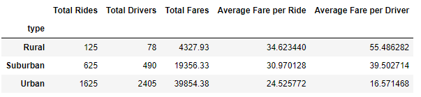
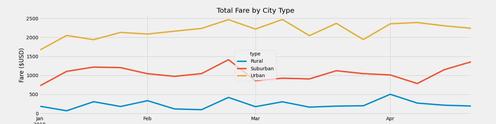

# Pyber_Analysis
## Overview
### Purpose
The purpose of this project is to analyze data accumulated from the Pyber ride sharing application and look for correlations between fare amounts and city types. This will help give us an uderstanding of the metrics in the types of cities that Pyber operates in. Visualizing this data could help Pyber make decisions that could have a positive impact to improve the access and affordability that customers have on the ride sharing service.
## Results
### Pyber Summary

Shown in the graph above is a summary of Pyber's metrics by city type. You can see that:

- Urban cities get the most number of rides and have the highest total fares, but the lowest average share per ride and per driver.
- Rural cities has the least amount of rides and the least amout of total fares, but has the highest average fare per ride and per driver.
- Suburban cities metrics are inbetween the two other types of cities. 
- The more rides there are in a city the less expensive a ride costs. 

### Pyber Fare Summary

Shown in the graph above is a summary of Pyber's total fares for each week separated by city type, from January 2019 to April 2019. In this table you can see that, like the table above, Urban cities had the most total fares per week. And that Rural cities had the least amount of total fares. It can also be seen that in the third week of Feburary there was a small spike in total fares for each city type and the same time. 

## Summary
1. For the Rural cities, you could offer promotions to people interested in driving in rural areas. Having more drivers in rural areas could decrease the cost of the ride and could potentially increase the amount of riders willing to use the service.
2. More information should be collected on the average length per trip. Rural areas are typically more spread out, while urban cities are more compact. If cost is directly correlated with distance per trip, it could explain why Rural customers could be deterred to use the service and why Urban customers are more likely to use the service. Coming up with a different pricing model to use in each city type, making it for affordable to use the service in Rural areas could help attract customers in that city type. 
3. Since Urban cities are where a majority of the Pyber's profits come from, the company should invest in marketing to maintain the high rider count and attract new customers.
